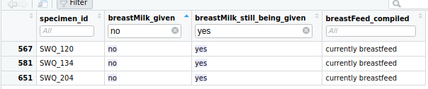

```{r setup, include=FALSE}
knitr::opts_chunk$set(echo = FALSE)

if(!require(pacman)) install.packages("pacman")
pacman::p_load(reactable, tidyverse, plotly)

```

## 1. Introduction

### 1.1. Metadata/epiData (n = 900)

Two datasheets were shared with me on 11 March 2025, consisting of epiData (mixed with the ongoing workLab & workWGS information); I re-downloaded the data on 27 March 2025 and clarify the content on 28-30 March 2025 (denoted as \_ver4).

1.  **DATABASE PENELITIAN PNEUMOKOKUS (Manado, Lombok, Sorong, Sumbawa).xlsx**: An Excel file separated by sheets for every region (focused on Lombok and Sumbawa, but also including Manado and Papua). There are information about ongoing WGS preparation for problematic samples (the "need confirmation" sheets).

    I generate another df for the ongoing, updated workLab data.

2.  **Data WGS_Lombok.xlsx**: An information storage for *in silico* WGS results for ALL samples (including Sumbawa; the title cannot be trusted XD).

I found "frameshift mutation" in dataframe Lombok (possibly because WGS data are updated but previous WGS data were still denoted as "N/A"). And double ID for LBK_044; possibly caused by a live data updated by the lab team during laboratory analysis. I cleaned up the data directly from google sheet on 17 March 2025 and conducted data cleaning analyses locally.

```{r}

```

Value corrections (typographical errors) and other calculations during vaccination (HiB & PCV13)

```{r}


```

Missing value (NAs) imputation using median or mode are cancelled based on common agreement at 26 March 2025; I let them empty and filter out the column for epiAnalyses:

```{r}


```

At the same time, I cleaned up the data by deleting awkward symbols and converting all values to lowercase (except for IDs). I changed "-" value to "tidak," then "no" and "ya" value to "yes". Additional inspections, such as checking for duplicated IDs (e.g. LBK_044) and ID naming inconsistencies, were performed on the real live data (the Google Sheet links).

### VALIDATION NEEDED (I don't think I can trust the data)

```{r}


cat("specifically for fever within past 3 days...")


```

### 1.2. workLab data (n = 900)

Since workLab data is gradually updated by the workLab team, I manually combine the data by selecting the first 12 (or 13) columns of epiData. I generated a new column called "**workLab_culture_result_final**" from the previous cultivation journal, incorporating the workLab team's cultivation notes (descriptive colonies), cultivation result (positive or negative) and their optochin testing results. Then, I checked the availability of fasta files and their previous workWGS results (whether they were successful, failed due to DNA extraction issues, RNA contaminations, etc).

### 1.3. workWGS data (n = 345)

WGS results available in **Data WGS_Lombok.xlsx** are based on fasta data uploaded to [PathogenWatch](https://pathogen.watch/). Since the IDs in the report are based on the header line of a fasta file (not the file name), I manually generated a new ID column called "dc_id" to correct naming inconsistencies.

I can't trust PathogenWatch's species determination and their MLST results, as many species that are *not identified* as pneumococcus (e.g. *Bacillus cereus*, *Haemophillus influenzae*, etc.) have large genome sizes, with many allelic profiles are *simply* denoted as "Novel". This suggest a high possibility of pneumococcus contamination during cultivation.

To ensure accuracy, I re-analysed all available fasta data using Torsten Seemann's **MLST** toolset (which technically performs **BLAST** on 7 housekeeping genes), checked for multiple-serotype contamination using Sheppard et al.'s **pneumoKITy** and re-assessed the quality of genome assemblies using **Bioconda::assembly-stats** (developed by Sanger Pathogens).

I generated a new column called, "**workWGS_stats_pneumo_cutoff**" to flag contaminated pneumococcus genome that fall outside 1.9 Mb-2.3 Mb and re-classified peumoKITy's result in "**workWGS_kity_predicted_serotype_regroup**".

In summary, species contamination occurred in some samples previously identified as other bacterium species, which resulted in identification of seven allelic profiles for pneumococcus. further validation using assembly-stats confirmed discrepancies in total genome length. These contaminations were not accounted for in PathogenWatch results. Moreover, PneumoKITy detected multiple serotypes/serogroups within some samples.

### 1.4. Fasta data (n = 345)

A total of 324 WGS files in \*.fasta format (including metadata) were shared to me on 11 March 2025, consisting of 189 Lombok files and 135 Sumbawa files. I generated a report for 19 missing files from Sumbawa, in the end, I obtained 21 additional files, bringing the total of 345 files (189 from Lombok and 156 from Sumbawa). Unfortunately, I found 49 files with naming inconsistencies—these files did not match their SPECIMEN ID in the epiData nor workLab_data.

```{r}


```

I copied these files into a separated folder and renamed them by adding an underscore ("\_") between the region code (LBK OR SWQ) and the ID number.

I conducted analyses on genome quality, MLST and multiple serotypes/serogroups for all fasta samples and compiled the results in the workWGS dataset, as previously described.
