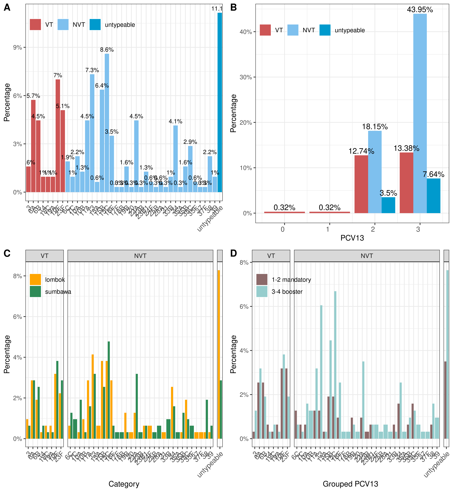

```{r setup, include=FALSE}
knitr::opts_chunk$set(echo = FALSE)

if(!require(pacman)) install.packages("pacman")
pacman::p_load(reactable, tidyverse, plotly)

```

## 1. Descriptive statistics

### 1.1. Methods

Pneumococcal carriage following PCV13 immunisation was assessed among children in two islands of Lesser Sunda Archipelago, Lombok and Sumbawa. We incorporated age group (\<1 year, 1-2 years, 3-5 years) along with other factors potentially influencing pneumococcal colonisation. *S. pneumoniae* species identification was determined using the combination of culture-based methods (physical characteristics and optochin assessment) and whole genome sequencing (WGS)-based approaches. I also test area as a potential confounder by implementing chi-square tests method from

To ensure accuracy on species identification, we evaluated the quality of genome assembly using **Bioconda::assembly-stats** (developed by Sanger Pathogens) and classified genomes into two categories: those with a genome length 1.9 Mb-2.3 Mb were considered pure pneumococcal genomes while those outside the ranges were classified as pneumococcal genomes with intra-species contamination. Further validation was performed using Torsten Seemann's **MLST** toolset, which conducts **BLAST** analysis on seven housekeeping genes. Multiple-serotype contamination was examined using Sheppard et al.'s **pneumoKITy**. Additionally, we uploaded the data to PathogenWatch (<http://pathogen.watch>) to obtain *in silico* identification of pneumococcus including their serotype determination, Global Pneumococcal Sequence Cluster (GPSC) classification, sequence type (ST), and antibiotic resistance profiling.

The vaccine serotypes included in PCV13 (1, 3, 4, 5, 6A, 6B, 7F, 9V, 14, 18C, 19A, 19F, and 23F). *S. pneumoniae* were classified as non-typeable if a serotype could not be determined *in silico*.

### 1.2. Results

### 1.2.1. EpiData

#### Data characteristics

A total number of 900 children were evenly assessed from Lombok (50%, n = 450) and Sumbawa (50%, n = 450), with equally represented males and females (48.78%, n = 439; 51.22%, n = 461, respectively). Overall, the study was dominated by children aged 3-5 years old (41.22%, n = 371), followed by children aged 1-2 years old (39.56% (39.56%, n = 356) and children below a year (19.22%, n = 173). 97.67% of the children (n = 879) were not consuming antibiotic in the past a month. Most of the children were currently breastfeed (50.44%, n = 454) or ever breastfeed (46.56%, n = 419), with only 3% of the children were never breastfed (n = 27).

#### Pneumococcal carriage

The pneumococcal carriage rate was slightly lower among males (42.82% (188/439)) compared to females (45.12% (208/461)). A slightly higher pneumococcal carriage was observed in Sumbawa (n = 204, 45.33%) compared to Lombok (n = 192, 42.67%). Among children assessed in Lombok, 3.78% (17/450) were under 1 year of age, with a pneumococcal carriage rate of 47.06% (8/17). In Sumbawa, 34.67% (156/450) of children were under 1 year, with a similar carriage rate of 44.87% (70/156).

Children who received three doses of the Hib pentavalent vaccine accounted for 51% (n = 459) of the study population, with a carriage rate of 45.1% (n = 207). Those who received four doses made up 49% (n = 441), with a slightly lower positivity rate of 42.86% (n = 189). Children who received one to two mandatory doses of the PCV13 accounted for 40.56% (n = 365) of the study population, with a positivity rate of 41.37% (n = 151). Those who received three to four doses made up 59.44% (n = 535), with a slightly higher positivity rate of 45.79% (n = 245).

Table 1

```{r}
report_epiTable <- 
  #read.csv("../outputs/epi_all_descriptive_percentages_report.csv") %>% 
  read.csv("../outputs/epi_all_descriptive_percentages_report_with_pValues.csv") %>% 
  dplyr::rename_with(~ gsub("report_", "", .x)) %>% 
  dplyr::mutate(estimate = round(estimate, 3),
                lower = round(lower, 3),
                upper = round(upper, 3),
                midp.exact = round(midp.exact, 3),
                fisher.exact = round(fisher.exact, 3),
                chi.square = round(chi.square, 3))

DT::datatable(report_epiTable, filter = "top",
              options = list(
                dom = 'Bfrtip',  # 'B' enables buttons, 'frtip' keeps search/filtering
                buttons = list('colvis'),  # column visibility toggle
                pageLength = 10,
                lengthMenu = list(c(5, 10, 25, -1),
                                  c("5 rows", "10 rows", "25 rows", "All"))
                ),
              extensions = 'Buttons')
```

### 1.2.2. Genome data

Pending

Filter out the data:

From positive samples, how many data failed to be processed due to RNA contaminations, etc.

Subset the data to only WGS-processed samples:

MLST, pneumoKITy and contamination profiles.

vaccine-types and non-vaccine-types

```{r}

```

## 2. Modelling

### 2.1. Methods

To determine the factors associated with the prevalence of pneumococcal carriage, we first tested area as a potential confounding factor. We then implemented a multivariable logistic regression model with a stepwise backward elimination process, including all covariates from a set of selected variables that exhibited no high collinearity. Variables with a significance level greater than 0.05 were removed from the model. All statistical analyses and data visualizations were performed using R version 4.4.3. P values \< 0.05 were considered statistically significant.

### 2.2. Results

### 2.2.1. EpiData

In a multivariate analysis, children with at least one respiratory illness in the past 24 hours had significantly higher odds of carrying pneumococcus (adjusted OR = 2.04, 95% CI = 1.39-3). The presence of other children in a household showed an association with pneumococcal carriage, although with no statistical significance: other children below 1 year old (adjusted OR = 1.8, 95% CI = 0.81-4.2, p = 0.16).

```{r}
# same data but focused on only final model plus filtered variables
report_model <- 
  read.csv("../outputs/epi_all_final_models.csv") %>% 
  dplyr::select(variable, value,
                univar_crude_OR_report, univar_crude_p.value,
                univar_plusArea_report, univar_plusArea_p.value,
                multivar_model1_report_OR, multivar_model1_p_value,
                # multivar_model2_report_OR, multivar_model2_p_value,
                multivar_final_report_OR, multivar_final_prz) %>% 
  dplyr::mutate(univar_crude_p.value = round(univar_crude_p.value, 2),
                univar_plusArea_p.value = round(univar_plusArea_p.value, 2),
                multivar_model1_p_value = round(multivar_model1_p_value, 2),
                # multivar_model2_p_value = round(multivar_model2_p_value, 2),
                multivar_final_prz = round(multivar_final_prz, 2))

DT::datatable(report_model, filter = "top",
              options = list(
                dom = 'Bfrtip',  # 'B' enables buttons, 'frtip' keeps search/filtering
                buttons = list('colvis'),  # column visibility toggle
                pageLength = 10,
                lengthMenu = list(c(5, 10, 25, -1),
                                  c("5 rows", "10 rows", "25 rows", "All"))
                ),
              extensions = 'Buttons')
```

```{r}
# same data but focused on only final model plus filtered variables
report_model_filtered <- 
  read.csv("../outputs/epi_all_final_models.csv") %>% 
  dplyr::select(variable, value,
                univar_crude_OR_report, univar_crude_p.value,
                univar_plusArea_report, univar_plusArea_p.value,
                multivar_model1_report_OR, multivar_model1_p_value,
                # multivar_model2_report_OR, multivar_model2_p_value,
                multivar_final_report_OR, multivar_final_prz) %>% 
  dplyr::mutate(univar_crude_p.value = round(univar_crude_p.value, 2),
                univar_plusArea_p.value = round(univar_plusArea_p.value, 2),
                multivar_model1_p_value = round(multivar_model1_p_value, 2),
                # multivar_model2_p_value = round(multivar_model2_p_value, 2),
                multivar_final_prz = round(multivar_final_prz, 2)) %>% 
  dplyr::filter(!is.na(multivar_final_prz),
                value != "(Intercept)"
                )

DT::datatable(report_model_filtered, filter = "top",
              options = list(
                dom = 'Bfrtip',  # 'B' enables buttons, 'frtip' keeps search/filtering
                buttons = list('colvis'),  # column visibility toggle
                pageLength = 10,
                lengthMenu = list(c(5, 10, 25, -1),
                                  c("5 rows", "10 rows", "25 rows", "All"))
                ),
              extensions = 'Buttons')
```

Sort of goodness of fit

```{r}
knitr::include_graphics("../pictures/epiAnalyses_all_multivariable_final_model.png")
```

However, the analysis indicated that area was not a confounder

### 2.2.2. Genome data

ssssss

Multivariate analyses for serotype related to carriage, vaccine types and non-vaccine types,

## 3. Discussion and conclusion
