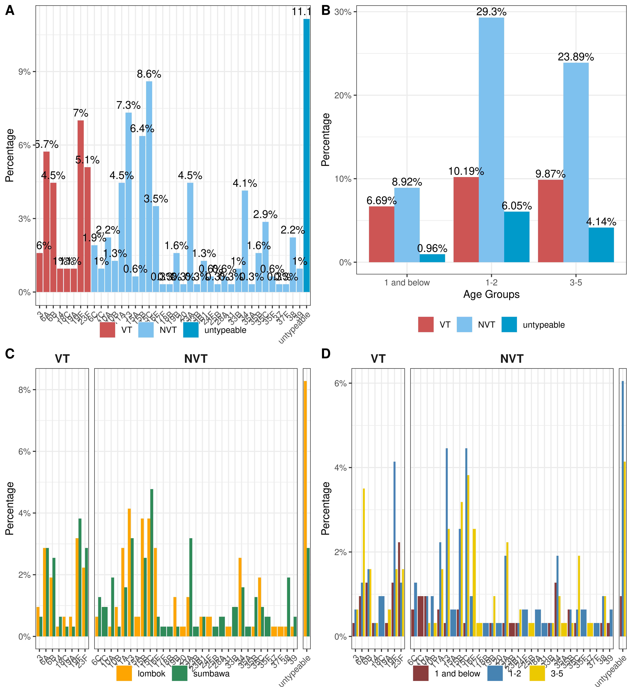

```{r setup, include=FALSE, , results='asis'}
knitr::opts_chunk$set(echo = FALSE)

if(!require(pacman)) install.packages("pacman")
pacman::p_load(reactable, tidyverse, plotly)
```

## R Markdown

This is an R Markdown presentation. Markdown is a simple formatting syntax for authoring HTML, PDF, and MS Word documents. For more details on using R Markdown see <http://rmarkdown.rstudio.com>.

When you click the **Knit** button a document will be generated that includes both content as well as the output of any embedded R code chunks within the document.

## Slide with Bullets

-   Bullet 1
-   Bullet 2
-   Bullet 3

## Slide with R Output

```{r results='asis'}
report_epiTable <- 
  #read.csv("../outputs/epi_all_descriptive_percentages_report.csv") %>% 
  read.csv("../outputs/epi_all_descriptive_percentages_report_with_pValues.csv") %>% 
  dplyr::rename_with(~ gsub("report_", "", .x)) %>% 
  dplyr::mutate(estimate = round(estimate, 3),
                lower = round(lower, 3),
                upper = round(upper, 3),
                midp.exact = round(midp.exact, 3),
                fisher.exact = round(fisher.exact, 3),
                chi.square = round(chi.square, 3))


htmltools::tags$div(
  style = "max-width: 90%; margin: auto;", # font-size: 11px;",
  # Table wrapper with compact style
  htmltools::tags$style(htmltools::HTML("
    table.dataTable th {
      font-size: 11px !important;
    }
    table.dataTable td {
      font-size: 11px !important;
    }
    .dt-button {
      font-size: 10px !important;
      padding: 2px 6px !important;
    }
    div.dt-button-collection {
      font-size: 10px !important;
    }
  ")),
  DT::datatable(report_epiTable, filter = "top",
              options = list(
                dom = 'Bfrtip',  # 'B' enables buttons, 'frtip' keeps search/filtering
                buttons = list('colvis'),  # column visibility toggle
                pageLength = 10,
                lengthMenu = list(c(5, 10, 25, -1),
                                  c("5 rows", "10 rows", "25 rows", "All"))
                ),
              extensions = 'Buttons')
)
```

## Slide with Plot

```{r, out.width = "80%", fig.align = "center"}

```
